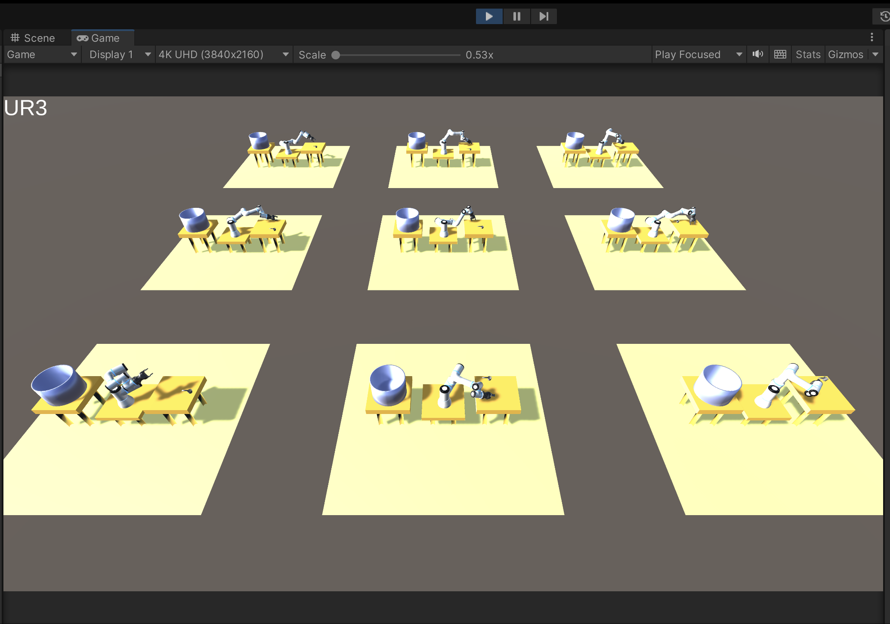

# RobotArmScooper



RobotArmScooper는 RobotArmSimulator 에 Unity MLAgent 를 결합해서 실제로 로봇팔로 강화학습을 시도해본 샘플 프로젝트입니다.

초보적인 수준으로 Robot 으로 수저를 집는 것만 해봤지만, ‘22년 4월 이후 더 이상 진행을 하지 못했기 때문에 이 정도에서 1차적으로 public 공개합니다.

## 사전 설치

이 프로젝트를 제대로 돌리기 위해선 다음 패키지들을 사전 설치해야합니다.

```
📌 
C# 및 Unity 지원 IDE (Visual Studio, Rider)
Unity 2021.3.X LTS version
ML-Agents Release 20
com.unity.ml-agents v2.3.0-exp.3
com.unity.ml-agents.extensions v0.6.1-preview
ml-agents v0.30.0
ml-agents-env v0.30.0
```

설치 방법은 인터넷을 참고하면 됩니다. 참고로 전 삽질 끝에 m1 macbook pro 에 개발 환경을 마련했었습니다.

2023 년 1월 기준으로 [ML-Agents Release 20](https://github.com/Unity-Technologies/ml-agents/releases/tag/release_20) 기준에서 이상없이 동작함을 확인했습니다.

## 훈련 방법


git clone 후 `RobotArmScooper` path 로 들어간 다음, 아래와 같이 mlagents-learn 을 동작시킨다.

만약 conda 를 사용한다면, 미리 ml-agents 를 설치해놓은 conda 환경을 활성화시키고 동작시켜야한다. 그렇지 않으면 동작 자체가 안된다.

```bash
cd RobotArmScooper
mlagents-learn config/ppo/pickup_spoon.yaml --run-id=PickUpSpoon --force
```

커맨드를 입력하고 Unity 화면에서 play 버튼을 누른다. 버튼 클릭 후 아래와 같이 Connect 화면이 팝업되면 성공이다.

```bash

            ┐  ╖
        ╓╖╬│╡  ││╬╖╖
    ╓╖╬│││││┘  ╬│││││╬╖
 ╖╬│││││╬╜        ╙╬│││││╖╖                               ╗╗╗
 ╬╬╬╬╖││╦╖        ╖╬││╗╣╣╣╬      ╟╣╣╬    ╟╣╣╣             ╜╜╜  ╟╣╣
 ╬╬╬╬╬╬╬╬╖│╬╖╖╓╬╪│╓╣╣╣╣╣╣╣╬      ╟╣╣╬    ╟╣╣╣ ╒╣╣╖╗╣╣╣╗   ╣╣╣ ╣╣╣╣╣╣ ╟╣╣╖   ╣╣╣
 ╬╬╬╬┐  ╙╬╬╬╬│╓╣╣╣╝╜  ╫╣╣╣╬      ╟╣╣╬    ╟╣╣╣ ╟╣╣╣╙ ╙╣╣╣  ╣╣╣ ╙╟╣╣╜╙  ╫╣╣  ╟╣╣
 ╬╬╬╬┐     ╙╬╬╣╣      ╫╣╣╣╬      ╟╣╣╬    ╟╣╣╣ ╟╣╣╬   ╣╣╣  ╣╣╣  ╟╣╣     ╣╣╣┌╣╣╜
 ╬╬╬╜       ╬╬╣╣      ╙╝╣╣╬      ╙╣╣╣╗╖╓╗╣╣╣╜ ╟╣╣╬   ╣╣╣  ╣╣╣  ╟╣╣╦╓    ╣╣╣╣╣
 ╙   ╓╦╖    ╬╬╣╣   ╓╗╗╖            ╙╝╣╣╣╣╝╜   ╘╝╝╜   ╝╝╝  ╝╝╝   ╙╣╣╣    ╟╣╣╣
   ╩╬╬╬╬╬╬╦╦╬╬╣╣╗╣╣╣╣╣╣╣╝                                             ╫╣╣╣╣
      ╙╬╬╬╬╬╬╬╣╣╣╣╣╣╝╜
          ╙╬╬╬╣╣╣╜
             ╙
        
 Version information:
  ml-agents: 0.30.0,
  ml-agents-envs: 0.30.0,
  Communicator API: 1.5.0,
  PyTorch: 1.8.0.post3
[INFO] Listening on port 5004. Start training by pressing the Play button in the Unity Editor.
[INFO] Connected to Unity environment with package version 2.3.0-exp.3 and communication version 1.5.0
[INFO] Connected new brain: PickUpSpoon?team=0
[WARNING] Deleting TensorBoard data events.out.tfevents.1647788529.yuncheoljung-ui-MacBookPro.local.6858.0 that was left over from a previous run.
[INFO] Hyperparameters for behavior name PickUpSpoon: 
        trainer_type:   ppo
        hyperparameters:        
          batch_size:   64
          buffer_size:  12000
          learning_rate:        0.0003
          beta: 0.001
          epsilon:      0.2
          lambd:        0.99
          num_epoch:    3
          shared_critic:        False
          learning_rate_schedule:       linear
          beta_schedule:        linear
          epsilon_schedule:     linear
        network_settings:       
          normalize:    True
          hidden_units: 128
          num_layers:   2
          vis_encode_type:      simple
          memory:       None
          goal_conditioning_type:       hyper
          deterministic:        False
        reward_signals: 
          extrinsic:    
            gamma:      0.99
            strength:   1.0
            network_settings:   
              normalize:        False
              hidden_units:     128
              num_layers:       2
              vis_encode_type:  simple
              memory:   None
              goal_conditioning_type:   hyper
              deterministic:    False
        init_path:      None
        keep_checkpoints:       5
        checkpoint_interval:    500000
        max_steps:      500000
        time_horizon:   1000
        summary_freq:   12000
        threaded:       False
        self_play:      None
        behavioral_cloning:     None
```

정상적으로 훈련이 진행되면 다음과 같이 진행 Log 가 계속 출력된다.

```bash
[INFO] PickUpSpoon. Step: 12000. Time Elapsed: 46.634 s. Mean Reward: -43.007. Std of Reward: 75.669. Training.
[INFO] PickUpSpoon. Step: 24000. Time Elapsed: 84.588 s. Mean Reward: -38.279. Std of Reward: 84.488. Training.
[INFO] PickUpSpoon. Step: 36000. Time Elapsed: 133.120 s. Mean Reward: -35.499. Std of Reward: 53.721. Training.
[INFO] PickUpSpoon. Step: 48000. Time Elapsed: 171.077 s. Mean Reward: -15.993. Std of Reward: 74.659. Training.
[INFO] PickUpSpoon. Step: 60000. Time Elapsed: 211.006 s. Mean Reward: -16.596. Std of Reward: 57.959. Training.
[INFO] PickUpSpoon. Step: 72000. Time Elapsed: 250.905 s. Mean Reward: -11.014. Std of Reward: 51.957. Training.
```

## Test 방법


훈련 완료 후, 별도의 설정 없이 Unity 에서 play 를 누르면 동작한다.